**VIRTUAL PRIVATE NETWORK**

Per spiegare l'utilità delle VPN è necessario distinguere una rete
privata in cui gli host si "fidano a vicenda" da una rete pubblica in
cui può succedere di tutto: spesso ci sono delle risorse che sono
accessibili solo dall'interno della rete privata per motivi di
sicurezza!

Come bisogna fare se si è in viaggio, ma è necessario accedere a quelle
risorse? Entrano allora in gioco le VPN! Le VPN permettono di accedere a
una rete privata, e di conseguenza a tutte le sue risorse, dall'esterno.

Il problema è che i pacchetti che noi inviamo a questa rete sono
costretti ad attraversare la pericolosa Internet: bisogna garantire
quindi Authentication (bidirezionale), Integrity, e Confidentiality!

Le VPN permettono di creare una connessione sicura con una rete privata
nonostante bisogna attraversare Internet.

{width="3.633371609798775in"
height="2.2344258530183727in"}

In genere il client accede alla rete privata tramite un server nella LAN
che offre ed espone questo servizio. Si possono distinguere le Remote
Access VPN che permettono all\'utente di collegarsi a una rete
aziendale, con le con le site-to-site VPN che invece connettono due reti
tra loro.

Allo scopo di garantire massima confidenzialità, è necessario criptare
l'intero pacchetto che va dal client alla rete privata, compresi gli
header! Come dovrebbero fare allora i router a indirizzare il mio
pacchetto verso la destinazione? L'idea è quella di incapsulare il
nostro pacchetto (cifrato) come payload di un altro pacchetto! La
consegna dei dati alla destinazione finale si compone di due fasi:

1)  Si invia un pacchetto che contiene come payload il pacchetto
    originale al server VPN

2)  Si inoltra il pacchetto originale alla destinazione nella rete
    privata

Ci sono due tecnologie principali che ci permettono di fare tunneling:
IPSec e TLS/SSL Tunneling. Il primo dei due lavora a livello IP, il
secondo invece lavora a livello applicativo incapsulando il pacchetto
come contenuto di un pacchetto TCP o UDP.

**IPSec** inserisce il nostro pacchetto (IP Packet, che vuole andare X
-\> Y) all'interno di un altro pacchetto che va da A verso B. Come
detto, IPSec lavora sul Network Layer (all'interno del kernel) rendendo
rischiose determinate operazioni come la cifratura del traffico.

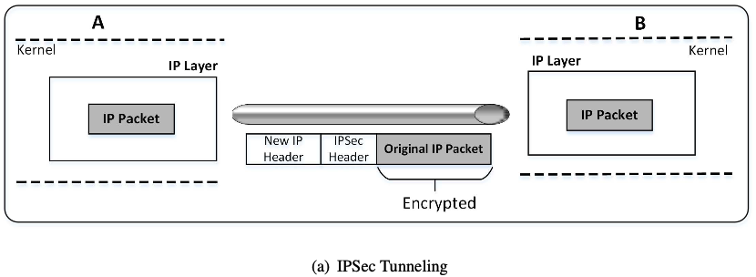{width="4.723958880139983in"
height="1.7251935695538059in"}

Un altro approccio è quello di effettuare un\'operazione simile, ma a
livello applicativo: **TSL Tunneling.** Supponiamo di avere il pacchetto
IP Packet (X-\>Y) che viene però portato a livello applicativo, e
inserito in un altro pacchetto (A-\>B). La comodità di questo metodo è
che ci permette di creare e configurare una VPN a livello applicativo
senza modificare il kernel. Questo approccio si chiama TLS/SSL tunneling
perchè in genere si implementa TLS su di esso... può altrimenti essere
chiamato Transport Layer Tunneling.

{width="4.744792213473316in"
height="1.7162007874015748in"}

Prima di concentrarci sul funzionamento di questo secondo tipo di
tunneling, diamo un'occhiata al funzionamento di IPsec e ai principali
protocolli VPN esistenti.

IPsec è una collezione di protocolli formati da:

- Protocolli che implementano lo [scambio delle chiavi]{.underline} per
  utilizzare crittografia, come **IKE (Internet Key Exchange)**.
  L'obiettivo di questo protocollo è di stabilire uno shared secret
  utilizzando Diffie-Hellman. A partire da questo shared secret si
  derivano le effettive chiavi simmetriche da utilizzare per il resto
  della comunicazione.

<!-- -->

- Protocolli che forniscono [autenticazione, integrità e
  riservatezza]{.underline}. In questo caso si usano due protocolli:
  **Authentication Header** (AH) che fornisce integrità tramite
  l'utilizzo di un hash, e **Encapsulating Security Payload** (ESP) che
  fornisce autenticazione e riservatezza tramite la cifratura.

IPsec si basa su due fasi:

1)  La prima delle due fasi è quella computazionalmente più pesante in
    cui si ha un'autenticazione tramite un certificato o una pre-shared
    key, e poi tramite il protocollo IKE si crea un segreto condiviso.
    Si utilizza poi questo segreto condiviso (DH key) per creare una
    chiave simmetrica (phase 1 symmetric key) e scambiarsi informazioni.
    Tramite questa fase si permette ai due estremi di comunicare.

2)  La seconda fase serve creare effettivamente la VPN. I due peer si
    scambiano informazioni, per esempio riguardo i tipi di algoritmi
    simmetrici che possono supportare in modo da scegliere il più
    sicuro. Infine si crea una nuova IPSEC symmetric key molto sicura e
    adatta al trasferimento di dati di larga scala.

La distinzione in fasi torna utile perchè si può completare la prima
fase solo una volta, e avere diverse fasi due (e quindi diversi canali
di comunicazioni) basati sulla stessa fase 1... si possono poi anche
chiudere questi canali di comunicazioni, ma senza dover buttare il
lavoro fatto per la fase 1 per un\'eventuale futura nuova comunicazione

segue immagine in cui è rappresentata la fase 1

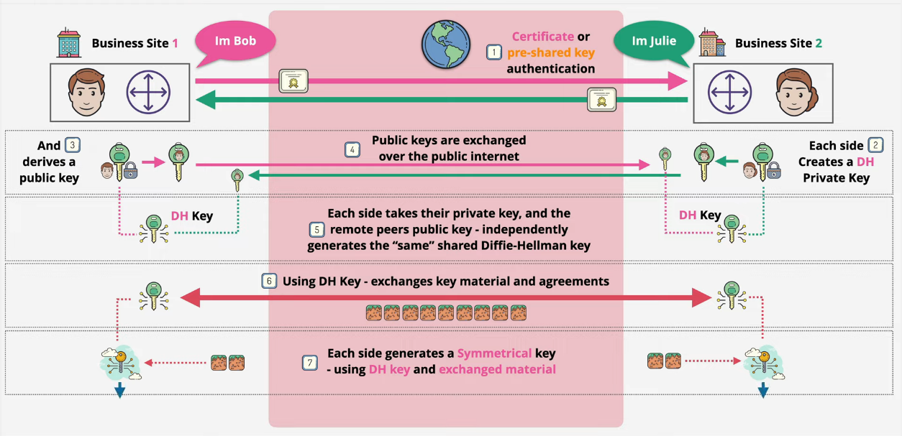{width="6.267716535433071in"
height="3.0277777777777777in"}

La maggior parte delle VPN, come detto, si basano sui due metodi di
tunneling visti precedentemente: IPSec tunneling e TLS/SSL tunneling.

Vorrei dare adesso una veloce overview sui protocolli VPN più
utilizzati:

- **PPTP:** non richiede di installare nulla, poco sicuro perché
  utilizza cifratura molto basica. Utilizza la porta tcp 1723 quindi
  semplice da bloccare per i firewall. Protocollo molto vecchio e non
  più utilizzato.

- **L2TP/IPSec**: Layer Two Tunneling Protocol, [il tunneling avviene al
  livello due]{.underline} e la sicurezza si basa sul protocollo IPSec
  che fornisce autenticità, integrità e confidenzialità. L'utilità di
  IPSec è quello di ottenere connessioni sicure su reti IP.

> Utilizza la porta UDP 500 quindi è facile da bloccare dai firewall. E'
> una versione migliore di PPTP ma ancora da migliorare.

- **IKEv2/IPsecv:** protocollo di microsoft e cisco

- **SSTP:** Protocollo proprietario di microsoft (quindi non open
  source), utilizza SSL 3.0 il che lo rende molto sicuro. Utilizza la
  porta 443 quindi può bypassare firewall facilmente.

<!-- -->

- **OpenVPN**: protocollo open source molto utilizzato che si basa su
  TLS/SSL e supporta molti algoritmi di cifratura. Utilizza porta 443
  quindi può superare i firewall facilmente. In questo caso è necessario
  però un software di terze parti. Quest'ultima è sicuramente la più
  versatile e sicura.

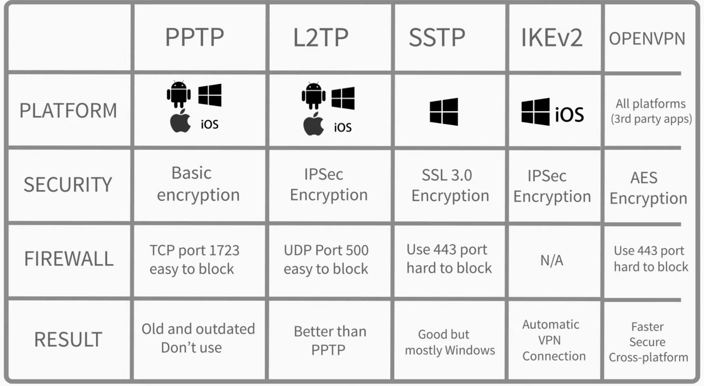{width="4.277606080489939in"
height="2.3382163167104113in"}

Tendenzialmente per le vpn site-to-site si utilizza il protocollo ipsec,
invece per le remote access vpn si può utilizzare tls/ssl tunneling. Il
motivo sta nel fatto che IPSec unisce al meglio due reti, mentre tls/ssl
è come se creasse un "portale" (tramite il browser?) all'interno della
rete privata remota.

Adesso vediamo nel dettaglio come sono creati i tunnel utilizzati nelle
TLS/SSL tunneling VPN. Questa tecnologia si basa su una particolare
interfaccia virtuale: **TUN/TAP**.

Vorrei prima di tutto ricordare che quando un pacchetto è spedito dal
mittente, questo attraversa il kernel il quale aggiunge, ai dati
inviati, gli header del caso per far sì i dati possano raggiungere la
destinazione. Allo stesso modo quando questo pacchetto arriva alla
destinazione attraversa lo stack di rete nel kernel, il quale rimuove
gli header per far sì che solamente i dati raggiungano il livello
applicativo. [E' possibile vedere gli header dei pacchetti del traffico
di rete tramite lo sniffing utilizzando il RAW Socket... il problema
però è che questo mostra a livello applicativo una copia dei pacchetti,
mentre il vero pacchetto continua il suo corso. Noi non vogliamo una
copia del pacchetto, ma il pacchetto con tutti gli header.]{.underline}

Questo problema è risolto grazie a un\'interfaccia virtuale, TUN/TAP,
che permette di prendere (o dare) dal kernel l'intero pacchetto senza
che attraversi lo stack di rete, e che quindi vengano rimossi gli
header.

Questo tipo di interfaccia, quindi, si collega da una parte al kernel e
dall'altra ad una applicazione: tutto ciò che è diretto a questa
interfaccia arriva all'applicazione con tutti gli header del caso (e
viceversa).

> {width="3.006103455818023in"
> height="2.531900699912511in"}

Se la nostra necessità è quella di inviare (o ricevere) semplicemente
dei dati ci serve un socket, così che il kernel aggiunga (o rimuova) gli
header del caso... ma se vogliamo dare il pacchetto compreso di header
al livello applicativo, risulta fondamentale questa interfaccia!

I pacchetti inviati alla TUN, vengono in realtà inviati a un programma a
livello applicativo.

TUN e TAP si distinguono in base al layer su cui lavorano: TUN si
collega al livello IP, mentre TAP si collega al Data-Link Layer...
cambiano di conseguenza gli header che otteniamo.

NOTA: IPSec non ha bisogno dell'interfaccia TUN perchè lavora già a
livello IP nel kernel

La topologia su cui faremo i nostri esperimenti è la seguente, in cui il
client vuole raggiungere la sua rete aziendale mentre è in viaggio...
supponiamo ovviamente che ci sia internet tra i due.

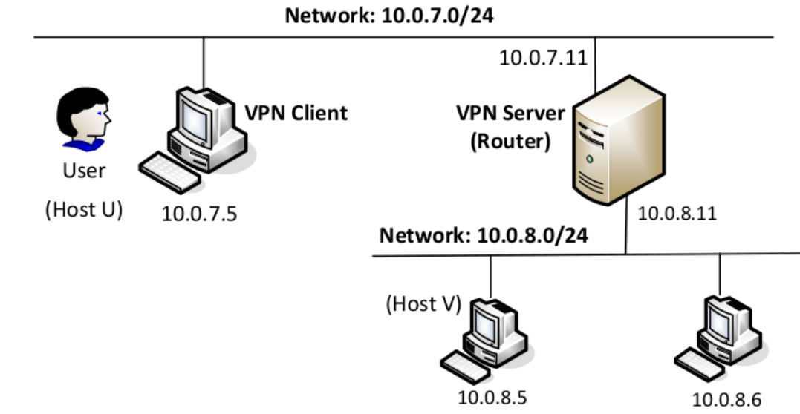{width="5.817708880139983in"
height="3.0019378827646546in"}

Iniziamo creando insieme una TUN/TAP interface in python.

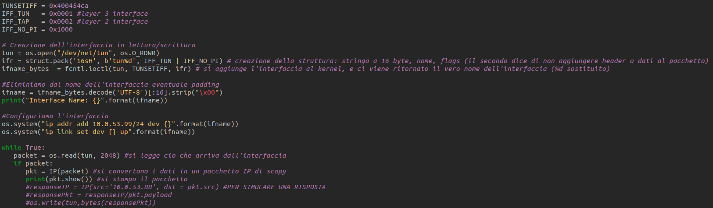{width="6.448277559055118in"
height="1.8782556867891513in"}

Il codice soprastante crea un\'interfaccia e gli assegna l'indirizzo IP
10.0.53.99

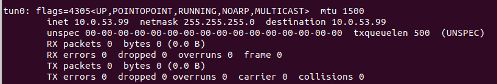{width="6.437189413823272in"
height="1.0810542432195975in"}

Per testare il funzionamento inviamo un pacchetto a un host nella rete
di questa interfaccia. L'host non esiste, di conseguenza non riceveremo
nessuna risposta... possiamo però vedere il pacchetto inviato (compreso
di tutti gli header) a livello applicativo.

NOTA: Non è una copia del pacchetto, ma il pacchetto vero e proprio.

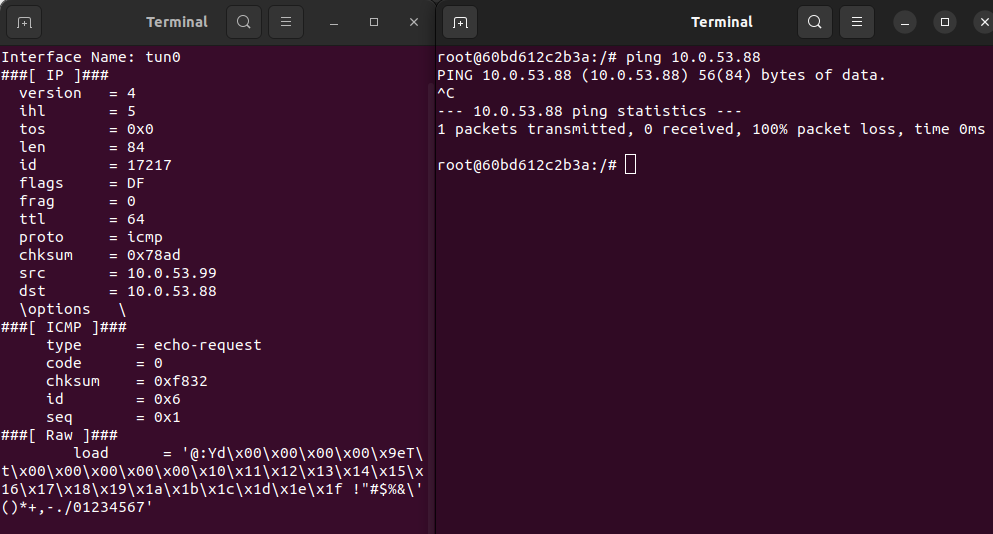{width="4.492839020122485in"
height="2.4427088801399823in"}

Ovviamente ping non otterrà risposta perchè l'host non esiste...
potremmo creare però la risposta manualmente dal codice tramite un
semplice spoofing!

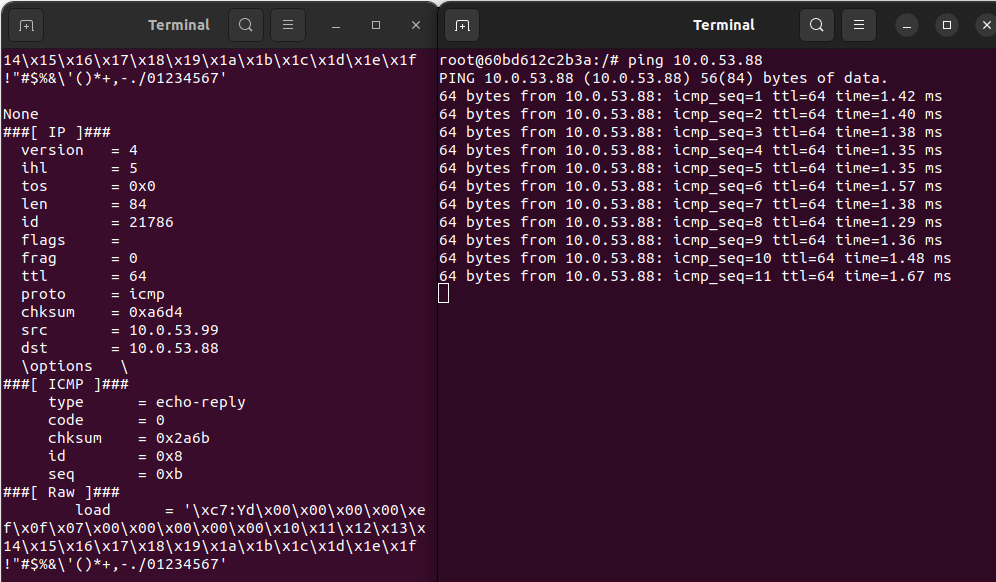{width="4.130208880139983in"
height="2.387082239720035in"}

Utilizzando il comando netcat il funzionamento è ancora più evidente!

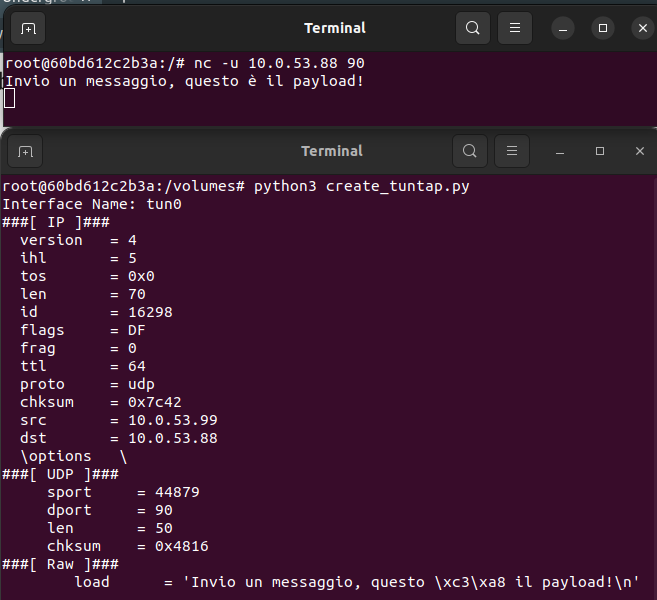{width="3.7288790463692036in"
height="3.4098304899387575in"}

NOTA: il codice python è solo un wrapper del codice c

Adesso facciamo qualche passo avanti, e iniziamo a vedere come questa
interfaccia viene utilizzata nelle VPN!

Ricordo che il nostro obiettivo è di far raggiungere al client U -\>
host V che si trova nella rete privata 10.0.8.0/24. Per evitare che il
nostro pacchetto U -\> V sia esposto alla pericolosa Internet, bisogna
inoltrare tutto il traffico diretto verso la rete di V all'interfaccia
tun0, la quale si occuperà di incapsularlo (eventualmente criptato)
all\'interno di un altro pacchetto, per poi inviare il tutto al VPN
Server.

L'interfaccia tun0 porta il pacchetto a livello applicativo mantenendo
tutti gli header. L'intero pacchetto, che dovrebbe andare da U a V,
viene quindi incapsulato in un altro pacchetto con destinazione il
server: questo pacchetto attraverserà il normale stack di rete, e la
solita rete Internet.

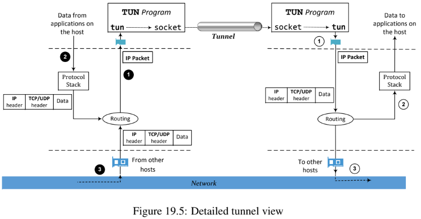{width="6.0601859142607175in"
height="3.1471358267716534in"}

Quando il client vuole inviare un pacchetto (a V compreso), questo passa
normalmente per lo stack di rete nel kernel che aggiunge gli header...
segue poi il routing. Se il routing stabilisce che il pacchetto deve
andare sulla tun interface, viene allora inviato ad essa (senza
eliminare gli header), dove c'è un\'applicazione che incapsula questo
pacchetto in un altro, e lo invia (tramite un normale socket) ad un
socket del server vpn.

Ci saranno quindi due pacchetti:

1)  10.0.53.99 -\> 10.0.8.6 che viene inviato alla tun interface (con
    header) e incapsulato nel pacchetto 2.

2)  10.0.7.5 -\> 10.0.7.11 che lascia il client da un normale socket
    passando per lo stack di rete, e raggiunge un altrettanto normale
    socket del server vpn.

Il client deve quindi inoltrare a tun0 tutto il traffico che deve
raggiungere la rete privata... ad ascoltare sulla tun0 c'è questa
applicazione che incapsula il pacchetto U-\>V in un altro pacchetto, e
poi invia il tutto al Server tramite socket.

> 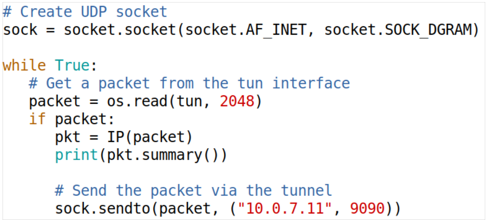{width="4.662066929133858in"
> height="2.134440069991251in"}

Il server apre un socket in ascolto, e stampa le informazioni dei
pacchetti che riceve.

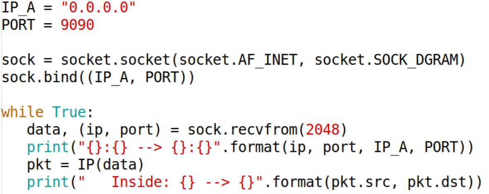{width="4.894189632545932in"
height="1.951172353455818in"}

Nella prossima figura vediamo sulla sinistra il client che si collega
via netcat con l'host 10.0.8.6, e sulla destra il pacchetto che arriva
al server. Da notare che il server stampa il payload del pacchetto
ricevuto... che corrisponde all'intero pacchetto che il client vuole
inviare all'host V.

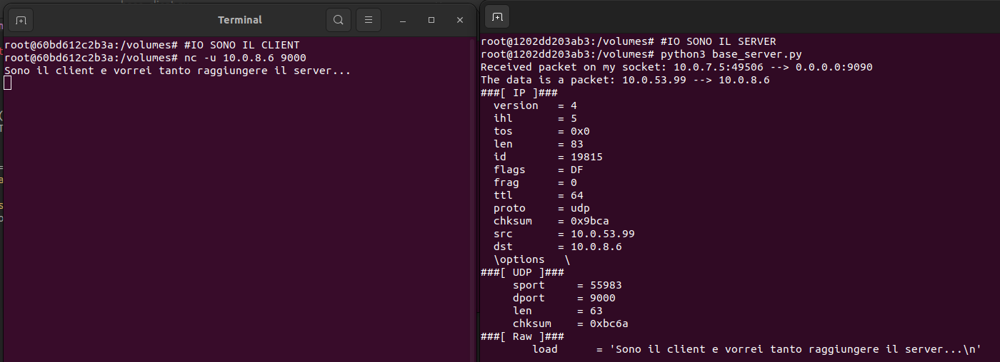{width="6.267716535433071in"
height="2.2777777777777777in"}

Facciamo un altro passo avanti, e facciamo raggiungere al pacchetto
inviato da U la destinazione V (che si trova all'interno della rete
privata).

Fino ad ora, quindi, il pacchetto del client (eventualmente criptato) è
nel server (che dovrebbe eventualmente decriptarlo). Questo pacchetto
deve adesso essere inoltrato ([tramite routing]{.underline}

Questo problema lo risolviamo tramite la classica TUN interface, così
che il kernel ottenga esattamente il pacchetto iniziale inviato da U
verso V.

Ricordiamo però che fino ad ora il server era solo un "computer", e non
un "router", che quindi scarterebbe i pacchetti non destinati a lui...
bisogna attivare l'ip forwarding!

sysctl net.ipv4.ip_forward=1

Riassumendo: il server riceve i pacchetti su un normale socket, prende
il payload (U-\>V) e lo invia tramite l'interfaccia TUN direttamente nel
kernel che procederà con il forwarding del pacchetto all'host V.

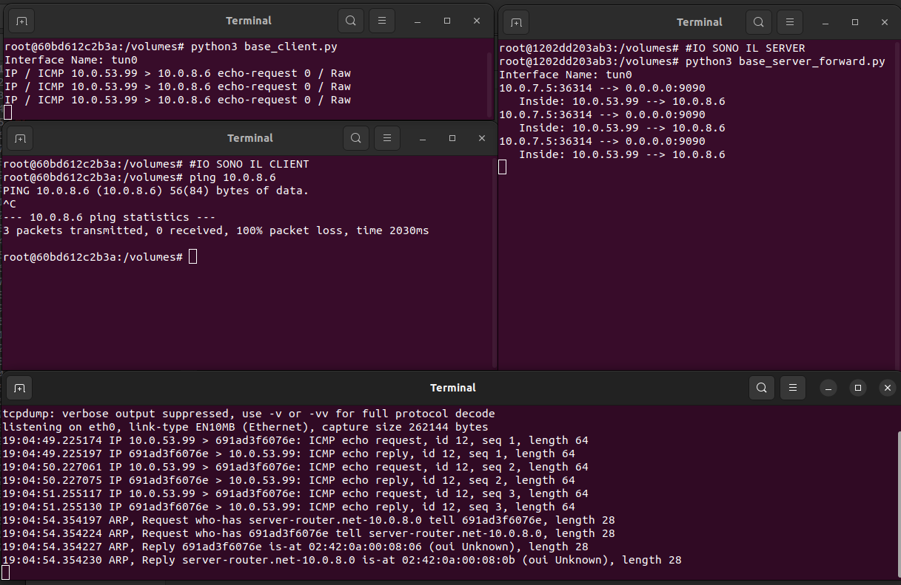{width="6.339583333333334in"
height="4.128336614173229in"}

Sulla sinistra U invia dei ping, sulla destra c'è il server che riceve i
pacchetti da U e vede come payload il pacchetto U-\>V. Questo pacchetto
U-\> V viene poi inviato all'interfaccia TUN così che il kernel possa
provvedere direttamente all'instradamento (verso V). In basso c'è V che
"sniffa" i pacchetti (tcpdump -i eth0) e vede arrivare quelli inviati da
U con sorgente 10.0.6.5.

Adesso manca solo un passaggio... fare in modo che U riceva risposta da
V!

E' importante rimarcare il fatto che l'indirizzo di sorgente di ogni
pacchetto è quello dell'interfaccia da cui esce la prima vola, quindi U
e V comunicano come 10.0.53.99 \<-\> 10.0.8.6, mentre U e il Server
comunicano come 10.0.7.5 \<-\> 10.0.7.11

Il server dovrà ascoltare su due interfacce allo stesso tempo:

1)  TUN per ricevere i pacchetti che vengono da U che vanno inoltrati a
    V

2)  Apre anche un socket su eth1 dove riceve i dati da V che devono
    essere inviati a U

Diventa quindi necessario l'utilizzo della chiamata select()

Quando il server riceve dati sul socket, significa che il client ha
inviato un pacchetto e il server dovrà inoltrare il payload (U-\>V) alla
TUN così che il routing faccia il suo corso. Quando il server, invece,
riceve sulla TUN, significa che un host della rete privata vuole inviare
pacchetti ad U, quindi deve incapsulare questo pacchetto in un altro, e
inviarlo a un socket in ascolto su U.

NOTA: PER DEFAULT ROUTING IL PACCHETTO DI V VA SU ETH1 VERSO IL
SERVER... QUESTO PACCHETTO HA DESTINAZIONE 10.0.8.6.... A QUESTO PUNTO

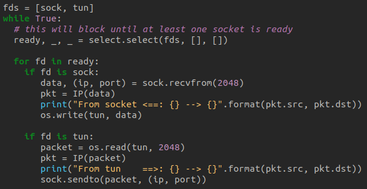{width="4.738005249343832in"
height="2.4319663167104113in"}

Parallelamente, se il client riceve sull'interfaccia TUN, significa che
vuole inviare i dati a un host nella rete privata, quindi incapsula il
pacchetto e lo invia al socket del server. Se invece riceve dati su un
socket, che apriamo appositamente, significa che un host della rete
privata gli sta inviando dei pacchetti.

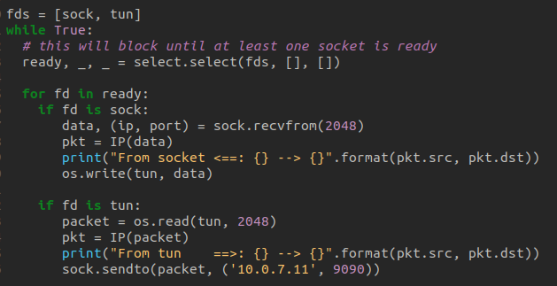{width="4.916865704286964in"
height="2.529296806649169in"}

Nella prossima figura sulla sinistra c'è il client (U), sulla destra il
server, e in basso l'host (V) nella rete privata.

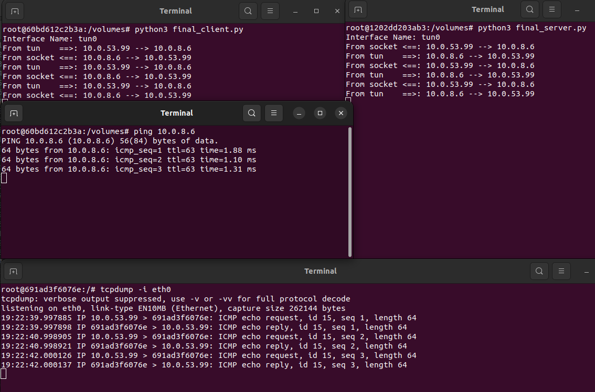{width="6.267716535433071in"
height="4.138888888888889in"}

Si può vedere che il pacchetto parte dalla TUN del client, arriva al
socket del server, il quale tramite la TUN fa procedere il pacchetto
originario per il routing in modo che raggiunga V.

Successivamente V invia la sua risposta alla tun del server, il quale
invia al socket del client il pacchetto incapsulato.

NOTA: se vuoi che sia utilizzata la VPN per andare su internet, invece
che solo in una particolare rete privata, bisognerà cambiare la route
per la destinazione 0.0.0.0, così qualsiasi pacchetto questo sia
rediretto verso la VPN server.

Vediamo adesso altri utilizzi delle VPN.

Ci sono molte situazioni in cui i firewall sono troppo restrittivi
creando problemi per gli utenti... Un esempio è il filtraggio del
traffico in uscita che impedisce di raggiungere determinati siti.Un
approccio per risolvere questo problema è il tunneling, tramite il quale
si nasconde il vero traffico dell'utente.

Ci sono diversi tipi di tunneling, tra cui le VPN e il port forwarding.
La differenza tra i tipi di tunneling sta in come il pacchetto raggiunge
l'inizio del tunnel: nel caso delle VPN si basa sul Network Layer (o
Data Link), nel caso del Port Forwarding invece sul Transport Layer.

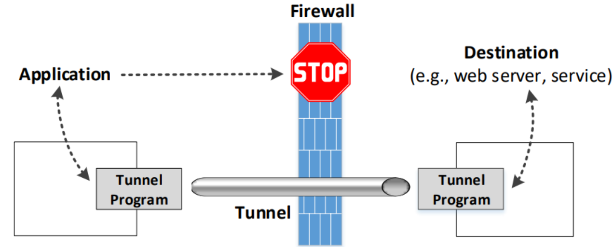{width="4.883766404199475in"
height="1.971353893263342in"}

L'idea generale è semplice: si utilizza un tunnel come canale di
comunicazione tra due lati diversi del firewall. L'utente invia i dati a
un programma che si trova sullo stesso lato del muro (che quindi può
raggiungere), mentre questo programma è libero di comunicare con la
destinazione voluta dall'utente (il suo firewall glielo permette).

I firewall possono essere egress o ingress:

- egress sono quelli che controllano il traffico in uscita

- ingress sono quelli che controllano il traffico in ingresso

Il nostro laboratorio sarà composto da una rete dell'azienda (sotto) e
una rete di casa (sopra). Tieni a mente gli host home e apollo!

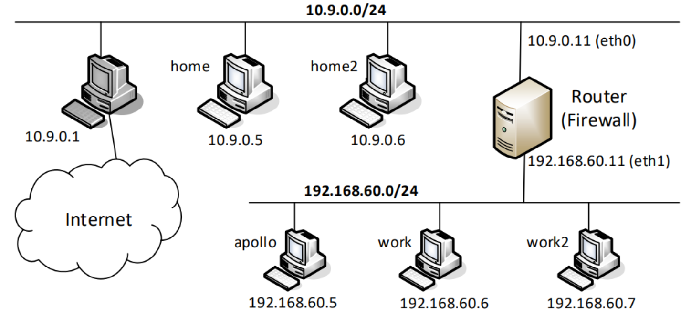{width="5.787237532808399in"
height="2.654296806649169in"}

RICORDA: controlla che le interfacce del router siano quelle
corrispondenti (ip -br address)

Questa rete si crea facilmente tramite un docker-compose che genera i
container e li connette tra di loro specificando le routes.

La prima cosa da fare è configurare il firewall sul router:

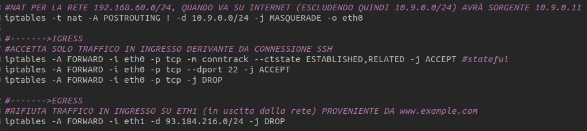{width="6.267716535433071in"
height="1.4027777777777777in"}

Prima di tutto si configura un NAT per i pacchetti che escono
dall'interfaccia eth0 in modo che abbiano l'indirizzo IP del router
(tranne quelli diretti alla rete 10.9.0.0/24)\... in pratica i pacchetti
dell'ufficio che vanno in Internet avranno IP 10.9.0.11

Poi sono settate delle regole che accettano in ingresso sull'interfaccia
eth0 [solo]{.underline} il traffico proveniente da una connessione ssh
(che si stia stabilendo, o già stabilita grazie al firewall stateful).

Infine si blocca il traffico in uscita verso la rete 93.184.216.0/24
dove è presente www.example.com

Il risultato, è che chi è nella rete "home" può raggiungere la rete
"work" solo tramite ssh... e che chi è nella rete "work" non può
raggiungere il sito
[[www.example.com]{.underline}](http://www.example.com)

> 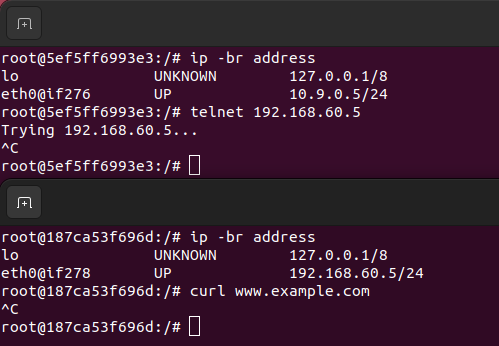{width="3.499882983377078in"
> height="2.425780839895013in"}

Ci sono molti modi per creare/utilizzare delle VPN, e noi utilizzeremo
un tool esistente che permette di creare un tunnel VPN: OpenSSH. Per
utilizzare questo tool bisogna cambiare delle impostazioni nel file di
configurazione di ssh per permettere il tunneling (vedi Dockerfile)

**Iniziamo bypassando l\'ingress firewall!**

Per creare un tunnel (home -\> work)dobbiamo lanciare il seguente
comando su una macchina in home:

ssh -w 0:0 root@192.168.60.5 -o \"PermitLocalCommand=yes\" -o
\"LocalCommand=ip addr add 192.168.53.88/24 dev tun0 && ip link set tun0
up\" -o \"RemoteCommand=ip addr add 192.168.53.99/24 dev tun0 && ip link
set tun0 up\"

Il risultato dopo questo comando è che si è creata un interfaccia TUN
sul server e una sul client. Seguono poi i comandi da lanciare sulle due
rispettive macchine per assegnare l'indirizzo alla tun interface, e
renderla up.

NOTA: 0:0 indica di chiamare le interfacce tun0

Adesso bisogna reindirizzare il traffico che ha destinazione
192.168.60.0/24 verso l'interfaccia tun0, invece che verso il router. Da
notare che dobbiamo considerare l\'eccezione del traffico diretto verso
192.168.0.5 (apollo, il vpn server)... se reindirizzassimo anche questo
traffico ovviamente cadrebbe il tunnel.

ip route replace 192.168.60.0/24 dev tun0

ip route add 192.168.60.5 via 10.9.0.11

L'ultimo passaggio è quello di configurare un NAT sul server VPN
(apollo), cosi' che tutti coloro che appartengono alla rete work pensino
che sia apollo a comunicare, invece della sorgente 192.168.53.88
dell'interfaccia tun0 del client... altrimenti la rete work non saprebbe
verso chi indirizzare i pacchetti di risposta non conoscendo
quell'indirizzo ip (a meno che non si cambiano le routing table di tutti
gli host nella rete work, ma non mi sembra il caso).

**NOTA SECONDO ME SE VUOI COMUNICARE SOLO CON APOLLO IL NAT NON SERVE**

iptables -t nat -A POSTROUTING -j MASQUERADE -o eth0

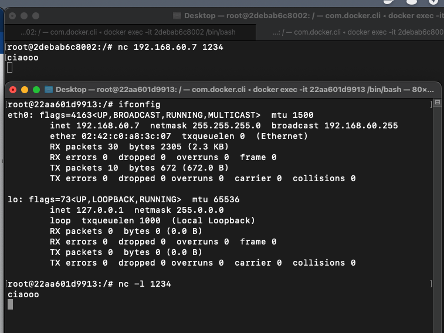{width="4.139058398950131in"
height="3.112988845144357in"}

adesso se ci mettiamo in ascolto su una macchina che è a lavoro,
possiamo raggiungerla

Vediamo adesso invece **come bypassare l'egress firewall** e permettere
agli impiegati di visitare
[[www.example.com]{.underline}](http://www.example.com) . La situazione
si scambia: apollo diventa il client e home diventa il server VPN.

ssh -w 0:0 root@10.9.0.5 -o \"PermitLocalCommand=yes\" -o
\"LocalCommand=ip addr add 192.168.53.88/24 dev tun0 && ip link set tun0
up\" -o \"RemoteCommand=ip addr add 192.168.53.99/24 dev tun0 && ip link
set tun0 up\"

Ovviamente ora è necessario ridirigere tutto il traffico verso
l'indirizzo proibito sull'interfaccia della VPN.

ip route add 93.184.216.0/24 dev tun0

Se vogliamo che tutti gli host della rete work possano raggiungere
questo fantomatico sito, bisognerebbe lanciare su ogni macchina

ip route add 93.184.216.0/24 via 192.168.60.5

Rimane solo un ultimo problema... ricorda che il pacchetto inviato dal
server vpn avrà come indirizzo di sorgente quello dell'interfaccia tun0.
Quando questo pacchetto esce dai container (o dalla macchina virtuale),
ci sarà un NAT che sostituirà l'indirizzo IP di sorgente con quello del
computer. Quando arriva la risposta, però, il NAT (della "VM") non sa
nulla dell'indirizzo dell'interfaccia tun0 del server VPN... quindi il
pacchetto verrà droppato. Per risolvere il problema bisogna configurare
il nat su home in modo che tutti i pacchetti che escono da li' (eth0)
prendano l'ip noto 10.9.0.5

iptables -t nat -A POSTROUTING -j MASQUERADE -o eth0

Ora puoi fare la tua curl

Vediamo adesso un alternativa molto più semplice da implementare delle
VPN, il **Port** **Forwarding**!

Eseguire una VPN richiede dei privilegi di root per creare una TUN
interface e cambiare le routing tables. Se questi permessi non fossero
disponibili, si potrebbe utilizzare un altro tipo di tunneling: il Port
Forwarding. Questo metodo lavora sopra il transport layer, quindi non ha
bisogno dei privilegi di root... il contro però è che diventa meno
trasparente paragonato a una VPN.

Nel prossimo esempio tutto ciò che arriva su home:8000 viene inoltrato
tramite apollo:22 su work:23. Sono utilizzati quindi tre pacchetti, il
primo (1) che raggiunge home:8000, un secondo che attraversa il tunnel
fino a apollo:22, e un terzo da apollo a work:23

NOTA: l'azienda vede il traffico ssh tra apollo e home, non un traffico
telnet tra home e work!

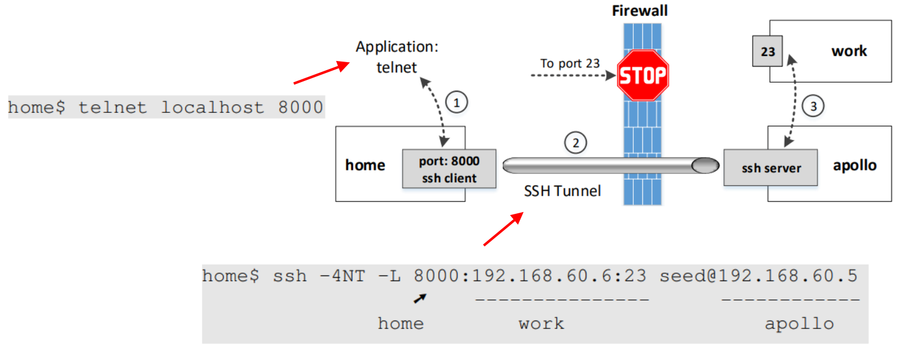{width="5.40653980752406in"
height="2.0566404199475063in"}

Iniziamo con il **bypassare l\'Ingress Firewall** con l'obiettivo di
collegarsi via telnet da home verso apollo.

Lanciamo sulla home il seguente comando che crea un tunnel tra "home" e
"apollo" inoltrando tutto il traffico della porta 8000 (della home)
sulla porta 23 di work .

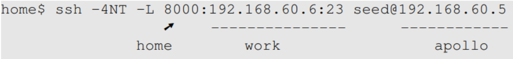{width="4.779683945756781in"
height="0.5600437445319335in"}

[Adesso quindi per connettersi in telnet con "work" dobbiamo connetterci
in telnet sulla porta 8000 di home]{.underline}

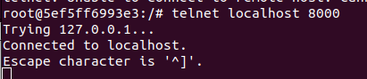{width="3.2734339457567803in"
height="0.7047615923009624in"}

Se vogliamo connettere una qualsiasi macchina all'interno della rete di
casa con un computer nella rete aziendale, dobbiamo specificare
l'hostname nel comando per creare il tunnel.

ssh -4NT -L 0.0.0.0:8000:192.198.69.6:23 root@192.168.60.5

Su home:

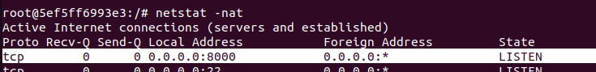{width="5.105725065616798in"
height="0.6149234470691164in"}

Vediamo adesso come **bypassare l'egress firewall** e permettere ai
dipendenti di accedere a
[[www.example.com]{.underline}](http://www.example.com) . Questa volta
il tunnel arriverà a "home" allo scopo di poter raggiungere Internet.

Bisogna lanciare su apollo il seguente comando

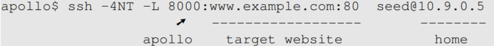{width="5.73125in"
height="0.5426596675415573in"}

Per permettere a tutti i dipendenti di raggiungere il sito,
parallelamente alla situazione di prima, il comando è:

ssh -4NT -L 0.0.0.0:8000:www.example.com:80 root@10.9.0.5

per effettuare una curl da una macchina nella rete aziendale utilizzando
il proxy:

curl \--proxy 192.168.60.5:8000 www.example.com

Nelle situazioni precedenti il port forwarding era da un client SSH
verso un server, dove il server era colui che metteva a disposizione
delle risorse al client, era anche colui che "offriva il servizio" del
tunneling. In alcune situazioni però, non è detto sia possibile avere un
server ssh... può darsi che le incoming ssh connection siano bloccate e
quindi un host all'interno della rete aziendale non possa avviare un
server ssh, e quindi il port forwarding, per permettere a un client a
casa di collegarsi e accedere a un sito privato.

Per risolvere questo problema è possibile creare un **Reverse ssh
tunnel**, che permette di avere una connessione ssh A-\>B, ma di
effettuare il port forwarding B-\>A.

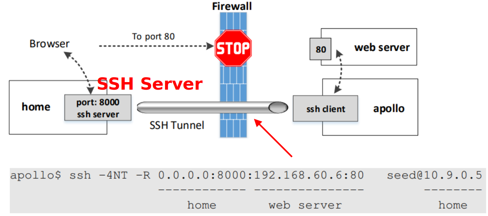{width="5.281327646544182in"
height="2.3423829833770777in"}

In pratica, tramite l'opzione -R, è il client SSH a offrire il port
forwarding nella sua rete.

Il comando soprastante, lanciato dal client ssh apollo, inoltra tutto il
traffico proveniente da home:8000 verso 192.168.60.6:80 (web server
locale aziendale)

Quando si manda una http request a home:8000, si verrà inoltrati a
apollo che inoltra la richiesta sulla porta 80 del web server locale.

NOTA: per poter effettuare il port forwarding per tutta la rete locale
di home (inserire 0.0.0.0) è necessario cambiare un impostazione del
file di configurazione di ssh: GatewayPorts clientspecified

Nelle situazioni viste fin'ora, il port forwarding inoltrava i dati solo
a una particolare destinazione... come facciamo ad avere un tunnel che
possa essere usato per più destinazioni? **Port Forwarding dinamico (o
Proxy)**!

Creiamo un tunnel tra apollo e home, così che possiamo i dipendenti
della rete aziendale possano navigare tranquillamente su Internet.

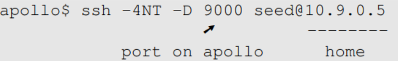{width="3.6718755468066493in"
height="0.55876312335958in"}

In questo modo, collegandosi alla porta 9000 di apollo, si viene
inoltrati in realtà a "home", liberandosi dal firewall dell'azienda.

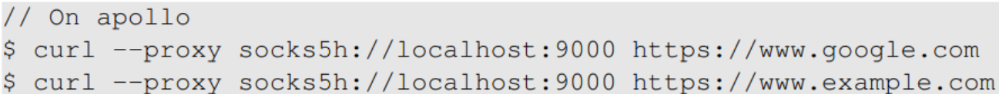{width="5.796875546806649in"
height="0.5488735783027121in"}

Questo tipo di proxy è chiamato SOCKS.

Per rendere utilizzabile il proxy agli altri componenti della rete, come
al solito, possiamo modificare il comando come segue:

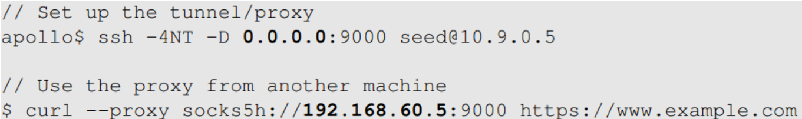{width="5.484375546806649in"
height="0.8108125546806649in"}

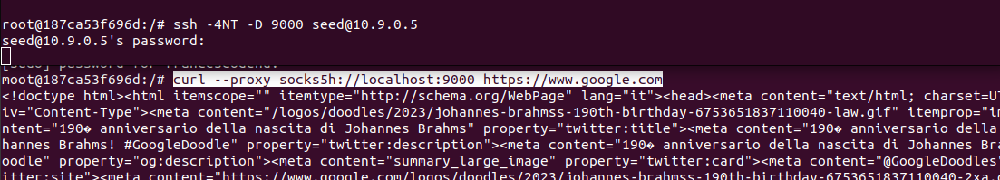{width="6.267716535433071in"
height="1.125in"}

Vediamo adesso nel dettaglio il funzionamento del **SOCKS Protocol**

Quando configuriamo il port forwarding, dobbiamo specificare dove
dovranno essere inoltrati i dati. Nel port forwarding dinamico, invece,
la destinazione non è specificata durante il setup. Come fa allora il
proxy a sapere dove inviare i dati? Grazie al protocollo SOCKS (Socket
Secure)! Chiamiamo l'applicazione "client", e il proxy "server":

- Il client e il server effettuano un handshake, in cui se necessario
  per esempio, si ha autenticazione

- Il client invia le informazioni sulla destinazione al server, cosi che
  il server (proxy) possa fare il setup del port forwarding.

Da notare che l'applicazione deve essere in grado di interagire con il
proxy utilizzando il protocollo SOCKS, il chè non è detto sia
supportato. Per questo motivo ci sono applicazioni come telnet che non
possono utilizzarlo... al contrario di Firefox e Curl.

UNA IDEA PER RISOLVERE IL PROBLEMA, E' CHE SE IL PROGRAMMA E' LINKATO
DINAMICAMENTE, POSSIAMO SOSTITUIRE LE CHIAMATE A FUNZIONI CHE SONO
NETWORK-RELATED CON FUNZIONI IN LBRERIA DINAMICHE CON CHIAMATE A UN USER
DEFINED WRAPPERS... COSI POSSIAMO USARE SOCKS5 PROXY SENZ ACAMBIARE
NULLA

Per capire meglio come funzionano i proxy SOCKS, implementiamo il nostro
client.

Il nostro obiettivo è inviare dati a un server netcat su "home" tramite
dynamic ssh port forwarding.

Prima di tutto avviamo netcat in ascolto su "home"

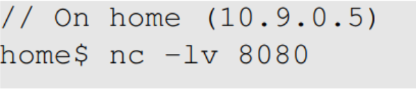{width="1.9395833333333334in"
height="0.4364063867016623in"}

Avviamo poi il proxy su apollo

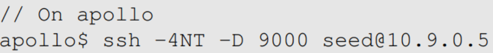{width="3.747916666666667in"
height="0.4041874453193351in"}

Il client che girerà su apollo, sarà come segue:

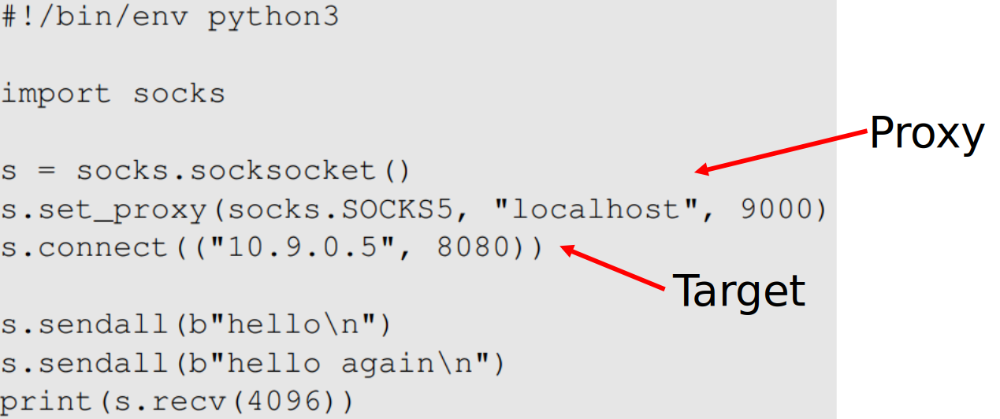{width="4.089583333333334in"
height="1.7100251531058617in"}

Prima diciamo al client dove si trova il proxy (localhost, 9000), segue
poi il metodo connect() che:

- crea una connessione tcp tra il programma python e il proxy (ovvero
  localhost:9000)

- inizializza il protocollo SOCKS definendo quale sarà la destinazione
  10.9.0.5:8080

Successivamente il proxy ssh inoltrerà tutti i dati che vengono dal
programma python fino all'altro capo del tunnel che poi saranno portati
verso la destinazione finale (netcat).

Riassumiamo infine le differenze tra una VPN e il Port Forwarding!

**La differenza fondamentale è che nel tunneling ognuno dei due host
comunica con un estremo del tunnel... per fare comunicare home e work
tramite apollo, home comunica con apollo e apollo comunica con work: il
tunnel non è trasparente, il client deve cambiare il suo comportamente,
inviando i pacchetti ad un middleman!** Ci sono tre pacchetti diversi!

Un altra caratteristica sta nel fatto che il port forwarding specifica
chi comunica con chi, limitando la comunicazione a due host. SICURO?
p221 primi righi

In ogni caso, entrambe queste modalità possono essere utilizzate per
superare firewall o per proteggere la comunicazione.

Queste due tecnologie si differenziano su:

- Trasparenza: il proxy non è trasparente per le applicazioni che lo
  usano, la VPN si'. In aggiunta, un\'applicazione deve avere il
  supporto a SOCKS per usare questo tipo di proxy.

- Setup: configurare una VPN è più complicato di un proxy... richiede
  privilegi di root per configurazione di tun/tap e modifica delle
  routing table. Al contrario per il proxy serve solo un programma (che
  supporti SOCKS5)

- Application-specific: una volta stabilito il port forwarding tra
  client e proxy con SOCKS5, può essere usato solo da un\'applicazione
  client... al contrario una volta stabilita una VPN tutte le
  applicazioni possono accedere alla rete.

- Encryption: le VPN sono criptate per definizione, i SOCKS5 proxy non è
  detto... in ogni caso se si utilizza ssh, la cifratura c'è.

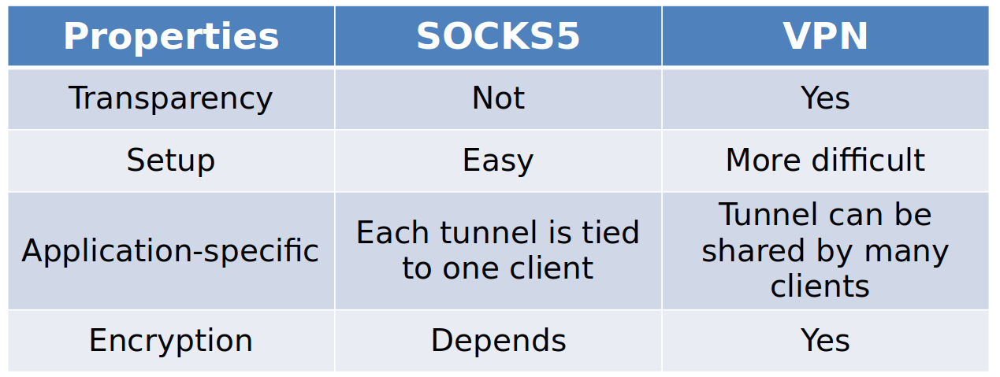{width="4.44218394575678in"
height="1.6733661417322834in"}

ATTENZIONE: spesso ci sono provider VPN che spacciano il loro servizio
per una VPN quando in realtà è solo un proxy
